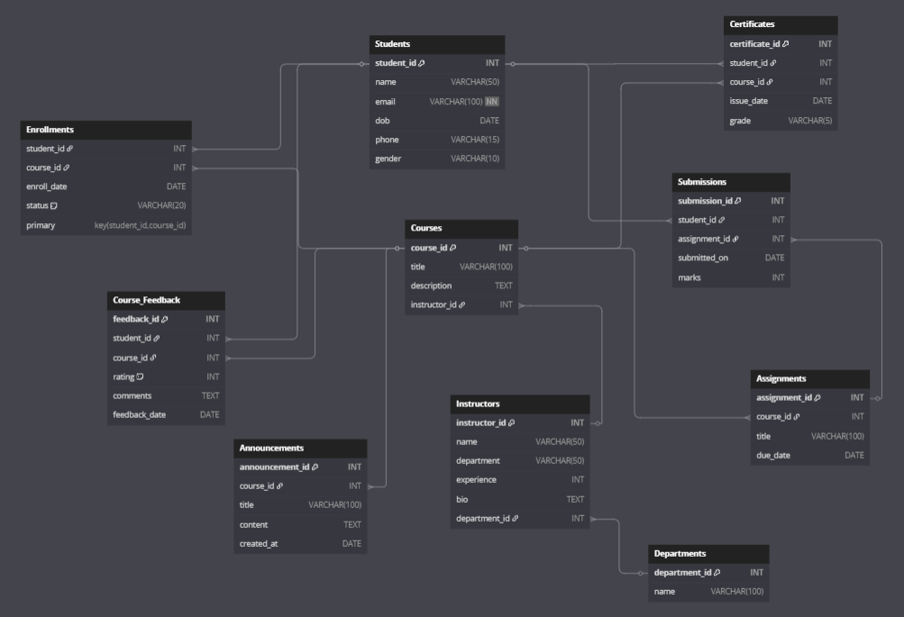

# 🧠 Online Course Management System (SQL Project)

An end-to-end **relational database project** simulating an online course management platform (think: Coursera, Udemy, etc.).

This project demonstrates:
- **Database schema design** (DDL): Tables, relationships, constraints  
- **Sample data population** (DML): Pre-filled with realistic records  
- **50 SQL queries**: CRUD, complex joins, aggregations, views, analytics  
- **ER Diagram**: Visual entity-relationship model

---

## 📌 Project Overview

This Online Course Management System (OCMS) is designed to manage:

- **Students** (registration, profiles)
- **Instructors** (profiles, departments, experience)
- **Courses** (curriculum, instructor linkage)
- **Enrollments** (students joining/dropping courses, status tracking)
- **Assignments** (course tasks, due dates)
- **Submissions** (assignment uploads, marks)
- **Course Feedback** (ratings, comments)
- **Certificates** (issued on course completion)
- **Admins** (platform administrators)
- **Announcements** (course-specific notices)
- **Departments** (organizing instructors/courses)

**Key SQL concepts covered:**
- Table creation with PK/FK constraints
- Normalization up to 3NF
- INSERT, UPDATE, DELETE operations
- JOINs (INNER, LEFT, RIGHT)
- Aggregate functions (`COUNT`, `AVG`, `SUM`), `GROUP BY`, `HAVING`
- `VIEW` definitions for reusable query logic
- Subqueries, nested queries, conditional DML

---

## 🔍 ER Diagram

  
*Created using dbdiagram.io*

- **Primary keys** are underlined  
- **Foreign keys** (FK) link tables  
- Cardinality (1-to-many, many-to-many via junction tables) is depicted

---

## 🔧 File Structure

```
Online-Course-Management-System/
├── schema.sql         # DDL: CREATE TABLE statements + DROP IF EXISTS
├── data.sql           # DML: INSERT statements to populate tables
├── queries.sql        # 50 SQL queries (CRUD, joins, views, analytics)
├── er_diagram.png     # ER diagram image
└── README.md          # Project overview and instructions
```

- **`schema.sql`**  
  Sets up all tables in correct order with DROP IF EXISTS to prevent conflicts.

- **`data.sql`**  
  Populates every table with realistic sample data (students, instructors, courses, etc.).

- **`queries.sql`**  
  Contains 50+ well-documented SQL statements demonstrating a wide range of operations.

- **`er_diagram.png`**  
  Visual summary of tables and their relationships.

---

## ⚙️ Setup & Usage

1. **Clone the repository**
   ```bash
   git clone https://github.com/AyanMujawar/Online-Course-Management-System.git
   cd Online-Course-Management-System
   ```

2. **Create & select your database**
   ```sql
   CREATE DATABASE ocms_db;
   USE ocms_db;
   ```

3. **Run the schema script**
   ```sql
   SOURCE /path/to/Online-Course-Management-System/schema.sql;
   ```

4. **Populate sample data**
   ```sql
   SOURCE /path/to/Online-Course-Management-System/data.sql;
   ```

5. **Verify tables and data**
   ```sql
   SHOW TABLES;
   SELECT * FROM Students LIMIT 5;
   SELECT * FROM Courses LIMIT 5;
   ```

6. **Run the queries**
   ```sql
   SOURCE /path/to/Online-Course-Management-System/queries.sql;
   ```
   - Queries are numbered and annotated for clarity.
   - You can copy/paste individual queries to test specific cases.

---

## 🧮 Sample Queries (Highlights)

Here are a few sample queries from `queries.sql`. Try them out!

```sql
-- 1. List all students enrolled in 'Intro to Python'
SELECT s.student_id, s.name, c.title
FROM Students s
JOIN Enrollments e ON s.student_id = e.student_id
JOIN Courses c ON e.course_id = c.course_id
WHERE c.title = 'Intro to Python';

-- 11. Find the average marks per assignment
SELECT a.title, AVG(sub.marks) AS average_marks
FROM Submissions sub
JOIN Assignments a ON sub.assignment_id = a.assignment_id
GROUP BY sub.assignment_id;

-- 28. VIEW: Student grades and certificates
CREATE OR REPLACE VIEW Student_Grades AS
SELECT s.name AS student_name, c.title AS course_title, cert.grade
FROM Certificates cert
JOIN Students s ON cert.student_id = s.student_id
JOIN Courses c ON cert.course_id = c.course_id;

-- 40. Use VIEW: List top-rated courses from the Course_Rating_Summary view
SELECT course_title, avg_rating
FROM Course_Rating_Summary
WHERE avg_rating >= 4.5
ORDER BY avg_rating DESC;

-- 46. Get the total number of assignments per course
SELECT c.title AS course_title, COUNT(a.assignment_id) AS total_assignments
FROM Courses c
LEFT JOIN Assignments a ON c.course_id = a.course_id
GROUP BY c.course_id;
```

---

## 📈 Project Highlights

- **Normalized Schema:** All tables are in 3NF to minimize redundancy.
- **Rich Sample Data:** Run meaningful queries with realistic records.
- **Comprehensive Query Set:**  
    - Selection & Joins (e.g., dropped students, instructor analytics)
    - Aggregations (`AVG`, `COUNT`), groupings, feedback summaries
    - Views for modularizing complex logic
    - Conditional and bulk updates/deletes
- **ER Diagram:** Quick visual understanding of data relationships.

---


## 🚀 Next Steps / Extensions

- **Build a Simple Web Interface:**  
  Use Flask, Node.js/Express, or PHP to connect and build CRUD pages (student registration, instructor dashboard, etc.).
- **Add Stored Procedures & Triggers:**  
  E.g., auto-generate certificates when all assignments are submitted.
- **Performance Tuning & Indexing:**  
  Add indexes, use `EXPLAIN` to analyze and optimize queries.
- **Data Export/Import Scripts:**  
  Export tables to CSV, write scripts for backup/ETL.

---

## ✨ Credits

**Project Author:**  
Ayan Mujawar  
B.Tech CSE, Pimpri Chinchwad College Of Engineering 
GitHub: [@AyanMujawar](https://github.com/AyanMujawar)

> ⭐️ If you found this useful, please star the repo and share your feedback!

For questions or suggestions, open an [issue](https://github.com/AyanMujawar/Online-Course-Management-System/issues) or contact me via GitHub.

---